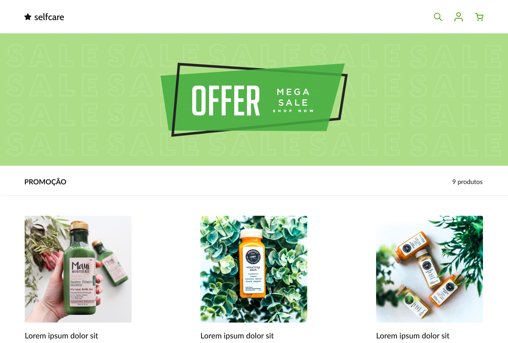

<h1 align="center"> SelfCare </h1>

Projeto da loja de produtos de beleza SelfCare  

  <a href="#-tecnologias">Tecnologias</a>&nbsp;&nbsp;&nbsp;|&nbsp;&nbsp;&nbsp;
  <a href="#-projeto">Projeto</a>&nbsp;&nbsp;&nbsp;|&nbsp;&nbsp;&nbsp;
  <a href="#-layout">Layout</a>&nbsp;&nbsp;&nbsp;|&nbsp;&nbsp;&nbsp;
  

 

  

## 🚀 Tecnologias

Esse projeto foi desenvolvido com as seguintes tecnologias:

- HTML e CSS
- Figma

## 💻 Projeto

O layout do projeto foi realizado pelo site Dev Challenge para construir uma pagina com HTML e CSS com base no projeto do Figma  
--> Para visualizar o site do projeto [CLIQUE AQUI](https://www.devchallenge.com.br/challenges?type=frontend)

## 🔖 Layout

Você pode visualizar o layout do projeto através [DESSE LINK](https://www.figma.com/file/d3XuxUt94vr0o4kBSo7IHC/Dev-Challenge?node-id=0%3A1&t=EDlHaIC1b4hSKMTs-0). É necessário ter conta no [Figma](https://figma.com) para acessá-lo.

